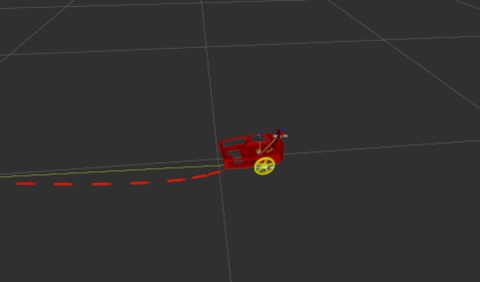

`robot.launch` launches the ROSRider board, differential drive controller, goal controller, odometry node, and is the basic robot bringup file.

`robot_cam.launch` is robot.launch, but with camera. You have to have a camera attached to your robot and configured.

`robot_ekf.launch` is robot.launch, but with fximu, and robot localization package configured. You need an IMU for this to work. Current configuration is for FXIMU.

`robot_ekf_cam_launch` is robot_ekf.launch, but with camera configured.

`remote.launch` launches rviz with everything configured for ROSRider.

### robot.launch

Execute the following commands:

    roscd rosrider/launch
    roslaunch/robot.launch

To see output, click [here](robot_launch.txt)

In another window, list topics by typing `rostopic list`, and you should see:

```console
/cmd_vel
/diff_drive_go_to_goal/cancel
/diff_drive_go_to_goal/distance_to_goal
/diff_drive_go_to_goal/feedback
/diff_drive_go_to_goal/goal
/diff_drive_go_to_goal/result
/diff_drive_go_to_goal/status
/goal_achieved
/initialpose
/joint_states
/joy
/left_wheel/control_effort
/left_wheel/pid_debug
/left_wheel/pid_enable
/left_wheel/position
/left_wheel/setpoint
/left_wheel/state
/move_base_simple/goal
/odom
/right_wheel/control_effort
/right_wheel/pid_debug
/right_wheel/pid_enable
/right_wheel/position
/right_wheel/setpoint
/right_wheel/state
/rosrider/diagnostics
/tf
/tf_static
/wheel_states
```

List services by typing the following command:

    rosservice list

You should see the list of services, which includes the services below:

```console
/rosrider/led_emitter
/rosrider/sysctl
```

### robot_cam.launch

>Notice: In order to launch the `robot_cam.launch` you need a camera attached and configured to your robot.

Execute the following commands:

    roscd rosrider/launch
    roslaunch/robot_cam.launch

To see output, click [here](robot_cam_launch.txt)

In another window, list topics by typing `rostopic list`, and you should see:

```console
/raspicam_node/camera_info
/raspicam_node/image_color
/raspicam_node/image_color/compressed
/raspicam_node/image_color/compressed/parameter_descriptions
/raspicam_node/image_color/compressed/parameter_updates
/raspicam_node/image_mono
/raspicam_node/image_mono/compressed
/raspicam_node/image_mono/compressed/parameter_descriptions
/raspicam_node/image_mono/compressed/parameter_updates
/raspicam_node/image_proc_node_debayer/parameter_descriptions
/raspicam_node/image_proc_node_debayer/parameter_updates
/raspicam_node/image_proc_node_rectify_color/parameter_descriptions
/raspicam_node/image_proc_node_rectify_color/parameter_updates
/raspicam_node/image_proc_node_rectify_mono/parameter_descriptions
/raspicam_node/image_proc_node_rectify_mono/parameter_updates
/raspicam_node/image_raw
/raspicam_node/image_raw/compressed
/raspicam_node/image_rect
/raspicam_node/image_rect/compressed
/raspicam_node/image_rect/compressed/parameter_descriptions
/raspicam_node/image_rect/compressed/parameter_updates
/raspicam_node/image_rect_color
/raspicam_node/image_rect_color/compressed
/raspicam_node/image_rect_color/compressed/parameter_descriptions
/raspicam_node/image_rect_color/compressed/parameter_updates
/raspicam_node/parameter_descriptions
/raspicam_node/parameter_updates
```

### robot_ekf.launch

>Notice: In order to launch the `robot_ekf.launch` you need imu sensor attached and configured to your robot.

Execute the following commands:

    roscd rosrider/launch
    roslaunch/robot_ekf.launch

To see output, click [here](robot_ekf_launch.txt)

In another window, list topics by typing `rostopic list`, and you should see:


### remote.launch

This file launches `rviz` with a configuration file for ROSRider. This is usually done in a remote computer, connected to `roscore` running at your robot. To accomplish this first set `ROS_MASTER_URI` and `ROS_HOST` environment variables.

`RVIZ` is the ROS visualization program. Whatever the state your robot is in, is depicted in rviz, along with other data such as camera, sensory, etc.

On your laptop type:

```
export ROS_MASTER_URI=http://robot.local:11311
export ROS_HOSTNAME=laptop.local
```

`robot` is the hostname of the robot, and `laptop` is the hostname of the client that you are connecting from. Both robot and client must be able to resolve and contact each other on the network.

>Consult to [NETWORKING](NETWORK.md) for detailed explanation, testing and troubleshooting.

Once networking is in order, type the following commands:

```
roscd rosrider/launch
roslaunch/remote.launch
```

RVIZ program should pop up, showing a model of a ROSRider robot. ROSRider's position, heading, and wheel joint angles will be depicted on `RVIZ`. Also, if the IMU and EKF is deployed, then if the robot is turned maually, it would also be depicted in `RVIZ`

You should see a robot like in the image below:

[](https://www.youtube.com/watch?v=1SKq0etHaYM "RVIZ Demo")

Click on the image above to see a video of ROSRider executing a `2D Nav Goal` given by RVIZ.

